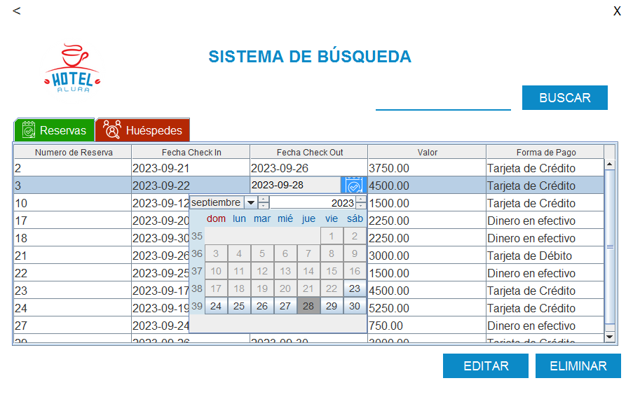

# Challenge Hotel Alura

Aplicación de Escritorio que consiste en un Sistema de Reservación para el Hotel Alura desarrollado para el Curso ONE - Alura Grupo 5.

En esta aplicación podemos registrar, editar y eliminar reservaciones y huespedes, que son almacenados en una base de datos.

## Funciones y Caracteristicas

- `Menu principal`: Pantalla de inicio donde se puede seleccionar el incio de sesión.

.

- `Pantalla de Login`: Autenticación de Usuario por medio de nombre de usuario y contraseña.

.
    
 El usuario y contraseña por defecto es: admin, admin. 

- `Menu de Usuario`: Pantalla con opciones para el registro de reservas o la busqueda de reservas registradas

   - Opción de registro de nuevos huespedes y reservas.
   - Opción de busueda de reservas, donde podremos consultar, editar o eliminar los registros de reservaciones y huespedes que se encuentran en la base de datos.

- `Registro de Reservas`: Formulario para especificar los datos de la reserva

 
 Especificamos los datos de la reserva que se va a registrar en la base de datos.
   
   - Fecha de Entrada (Se escoje de un Calendario despegable)
   - Fecha de Salida (Se escoje de un Calendario despegable)
   - Total de Reserva (Auto-calculado en función de las fechas seleccionadas)
   - Forma de Pago (Se escoje de una lista desplegable)

A continuación se muestran imagenes del manejo de este formulario

 Solo pueden seleccionarse fechas a partir del día actual, es decir, no puede esecificarse una fecha de entrada par un día que ya ha pasado

 Solo puede seleccionarse una fecha de salida que sea mayor a la fecha de entrada seleccionada

 Como trabajamos con registros en una base de datos es importante confirmar cada acción del usuario, además es importante informar al usuario de lo que sucede en la aplicación en todo momento

 Cuando el registro de la reserva se lleva a cabo exitosamente, informamos al usuario y le proporcionamos un Número de Reserva.

- `Registro de Huespedes`: Formulario para especificar los datos del huesped

Especificamos los datos del huesped que se va a registrar en la base de datos.
   
   - Nombre (No se permiten números ni caracteres especiales, solo letras, espacios y acentos)
   - Apellido (Aplican las mismas restricciones del campo de texto "Nombre")
   - Fecha de Nacimiento (Solo se permite el registro de huespedes mayores de edad + 18)
   - Nacionalidad (Se escoje de una lista desplegable)
   - Telefono (Solo se permiten números y deben ser 10 digitos)
   - Número de Reserva (Este campo no puede ser editado, su valor se establece con el número de reserva generado previamente)

A continuación se muestran imagenes del manejo de este formulario

 Solo pueden seleccionarse fechas de hace 18 años con respecto al día actual, es decir, solo pueden registrarse huespedes con mayoría de edad + 18 años. 

 Si el usuario quiere regresar al formulario anterior se le informa que deberá especificar nuevamente los datos de su reserva y se le asignará un nuevo número de reserva, es decir, la reserva anterior será deshechada.

 Si el usurio desea salir de la aplicación se le informará que será cerrada su sesión, será redirigido al menú principal y se perderan los datos de la reserva y el huesped, es decir, al salir sin terminar el registro se deshecharán los datos del huesped y de la reserva.

 Al presionar el boton para guardar su reserva y los datos del hueped, el usuario debe confirmar la operación, como se trabajará con registros de la base de datos es importante confirmar las operaciones del usuario.

 Cuando el usuario confirma que quiere guardar los datos de la reserva y del huesped, se procede a realizar el registro en la base de datos, si el proceso concluye exitosamente el usuario recibe un mensaje de confirmación, de lo contrario recibe un mensaje informando del error.

- `Sistema de Busqueda`: Podemos escoger entre 2 tablas para visualizar la información de los registros de reservas y huepedes

 En esta sección podemos consultar 2 tablas con los registros de reservas y clientes.

   - Podemos cambiar de una tabla a otra presionando la pestaña ubicada en el borde superior izquierdo de la tabla
   - Podemos consultar todos los registros (por defecto ordenados por número de reserva o huesped)
   - Podemos ordenar los datos de la tabla presionando el nombre de la columna que queremos ordenar
   - Podemos filtrar los registros por número de reserva o huesped, escribiendo el número en el campo de texto junto al botón de "Buscar"
   - Podemos filtrar los registros por nombre o apellido de huesped, escribiendo el texto buscado en el campo de texto junto al botón de "Buscar"
   - Podemos editar registros, modificando los datos de una fila y presionando el bóton "Editar"
   - Podemos eliminar registros, seleccionando una fila y presionando el bóton "Eliminar"
   - Al editar datos de una fila tendremos que seguir las mismas válidaciones que se especificaron en los formularios para registras nuevas reservas o huespedes
   - Después de editar o eliminar filas, las tablas reflejaran las modificaciones relizadas a los registros en la base de datos

A continuación se muestran imagenes con el funcionamiento de esta sección

 Al escribir un número en el campo de texto para busqueda, obtenemos un registro que corresponda con el número escrito, si el número especificado no existe nuestra tabla se mostrara vacía, podemos eliminar el filtro para volver a mostrar todos los registros presionando el boton rojo marcado con una "X" a un lado del campo de texto para busqueda

 

 Si el boton "Editar" es presionado y no se ha seleccionado una fila que pueda ser editada, se informa al usuario lo que debe hacer

 De la misma manera que en el formulario para registrar una reserva aquí aplicamos la misma validación, es decir, solo pueden seleccionarse fechas de entrada desde el día actual en adelante.

 Al editar la fecha de salida solo pueden seleccionarse fechas de salida posteriores al día seleccionado como fecha de entrada.

 Al editar la forma de pago solo podremos cambiar a una de las opciones mostradas en la lista desplegable.

 Una vez que el usuario ha modificado un registro y presiona el boton "Editar", le informamos que estos cambios no pueden revertirse y preguntamos si desea guardar los cambios de la edición

 Después de confirmar que desea guardar los datos modificados, recibirá un mensaje de confirmación exitoso, o en caso de que se presente un error se le infromará al usuario y los cambios hechos al registro será deshechados

El funcionamiento es el mismo al querer realizar modificaciones en la tabla de huespedes, a continuación se muestran algunas imagenes del manejo de esa tabla

 Al escribir un texto en el campo de busqueda podremos filtrar huespedes si es que su nombre o apellido contiene el texto buscado

  Una vez que el usuario ha seleccionado un registro y presiona el boton "Eliminar", le informamos al usuario que la eliminación no puede revertirse y preguntamos si desea continuar con la acción. Si se recibe la confirmación y el registro es elimiando con éxito el usuario recibirá un mensaje de confirmación, en caso contrario se le informará que se presentó un problema al eliminar el registro y el registro se mantendrá intacto.

- `Saliendo de la aplicación`: En cada una de las secciones de la aplicación se tiene acceso a un botón de "Cerrar", su función especifica dependerá de la sección en la que nos encontremos.

Veamos ambos casos a continuación:

 Si presionamos el botón "cerrar" en alguna sección donde tengamos una sesión abierta, se nos preguntará si deseamos cerrar sesión y regresar al menú principal, donde podremos salir de la aplicación.

 Si presionamos el botón "cerrar" en la pantalla del menú principal se nos preguntará si deseamos salir de la aplicación, en caso de confirmar, se cerrará la aplicación, en caso de cancelar nos mantendremos en la aplicación y para acceder a las funciones deberemos volver a iniciar sesión.

- `Otras caracteristicas`:
    - El registro de datos para la reservación está condicionado para fechas válidas, es decir, la fecha de entrada no puede ser de un día pasado, la fecha de salida debe ser posterior a la fecha de entrada.
    - El monto total de la reservación es auto-calculado en función de los días que componen la reservación.
    - En los campos de nobre y apellido se restringen los caracteres para no aceptar caracteres especiales ni números, solo letras, espacios y acentos.
    - El calendario para seleccionar la fecha de nacimiento del huesped solo acepta fechas de nacimiento de personas mayores a 18 años.
    - El campo para escribir el número telefonico solo acepta números y debe tener 10 digitos.
    - En la tabla de edición de datos de registros de reservas y huespedes se aplican las mismas restricciones antes mencionadas.
    - En la edición de datos no es posible modificar los campos de números de reservación y números de húesped.
    - En la edición de datos de reservación no es posible modificar el valor total de la reservación, pues este dato es auto-calculado en función de los diás seleccionados.
    - Al trabajar con registros en base de datos debems tener cuidado de modificar, crear o eliminar registros por error, por ello toda acción que involucre a la base de datos debe ser confirmada por el usuario
    - La tabla del menú de busqueda puede ordenarse presionando la columna por la que queremos ordenar los registros
    - La tabla también puede filtarse colocando el texto buscado en el campo especificado y presionando el boton "Buscar", los campos en los que se buscan coincidencias al escribir un número son "Número de Reserva" y "Número de Húesped", cuando se escribe un texto los campos buscados son "Nombre" y "Apellido"

## Acceso a la aplicación

En este repositorio se pone a disposición el archivo "Base de Datos - hotel_alura.sql", que es el script que se utilizó para crear la base de datos y tablas utilizadas para el funcionamiento de esta aplicación.

Además se pone a disposición el archivo "Hotel.jar", que es un ejecutable de la aplicación.

Para usar el proyecto se necesitan descargar los ficheros "Base de Datos - hotel_alura.sql" y "Hotel.jar". 

Antes de ejecutar la aplicación deberá tener instalada la base de datos MySQL y deberá ejecutar el script proporcionado. Las credenciales que buscará esta aplicación para acceder a la base de datos son:   Usuario:root   Contraseña:root

Una vez que las credenciales de la base de datos sean las adecuadas y se haya ejecutado el script para generar la base de datos y las tablas utilizadas en la aplicación, podemos ir a la carpeta de descargas de nuestro ordenador y ejecutar la aplicación "Hotel.jar" con uno de los siguientes métodos:
- Con un doble click
- Con la opción "Abrir" del menú contextual del archivo (el menú contextual se despliega al hacer click derecho sobre el archivo)
- Seleccionando el archivo y presionando la tecla 'Enter'

### Requisitos

Java SE 8
Base de datos MySQL (El script para crear la base de datos y las tablas se pone a disposición en este repositorio)

Las credenciales de la base de datos deben ser las predeterminadas para MySQL:
Usuario: root
Contraseña: root

## Técnologias Usadas

- Lenguaje Java (JDK 1.8.0_241)
- IDE VSCode (Extension Pack for Java v0.25.13)
- Manejo de Dependencias Maven
- Base de Datos MySQL
- Interfaz Gráfica desarrollada con Java Swing
- Libreria JCalendar para aplicar en JDateChooser

## Autor

Proyecto desarrollado con fines educativos por: Rodrigo Adrian Medellín Flores.

Curso ONE Grupo 5 - Alura Latam.

